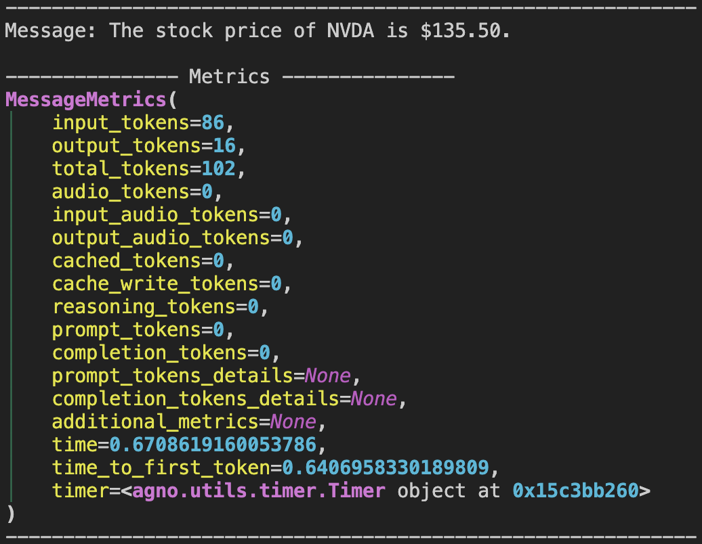
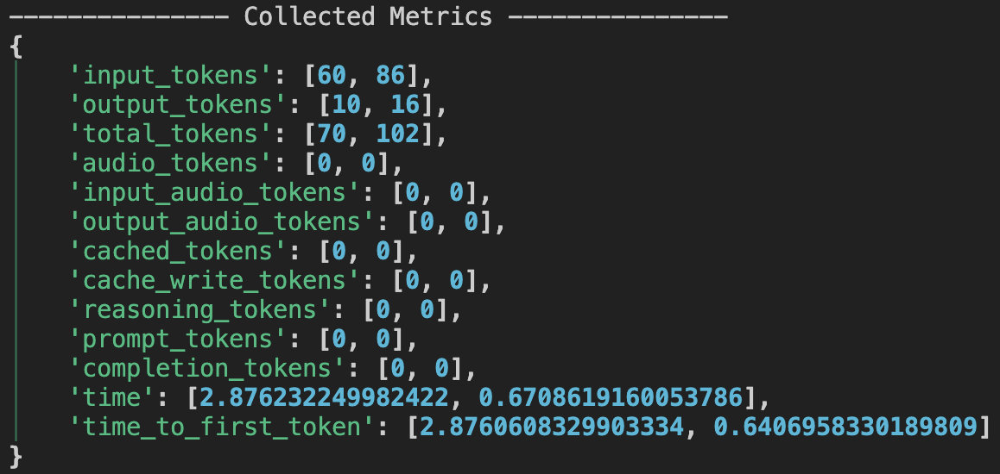

## Overview
When you run an agent in Agno, the response you get (**RunResponse**) includes detailed metrics about the run. These metrics help you understand resource usage (like **token usage** and **time**), performance, and other aspects of the model and tool calls.

Metrics are available at multiple levels:
- **Per-message**: Each message (assistant, tool, etc.) has its own metrics.
- **Per-tool call**: Each tool execution has its own metrics.
- **Aggregated**: The `RunResponse` aggregates metrics across all messages in the run.

<Note>
Where Metrics Live
- `RunResponse.metrics`: Aggregated metrics for the whole run, as a dictionary.
- `ToolExecution.metrics`: Metrics for each tool call.
- `Message.metrics`: Metrics for each message (assistant, tool, etc.).
</Note>

## Example Usage
Suppose you have an agent that performs some tasks and you want to analyze the metrics after running it. Here's how you can access and print the metrics:

You run the following code to create an agent and run it with the following configuration:
```python
from typing import Iterator

from agno.agent import Agent, RunResponse
from agno.models.google import Gemini
from agno.tools.yfinance import YFinanceTools
from rich.pretty import pprint

agent = Agent(
    model=Gemini(id="gemini-2.0-flash-001"),
    tools=[YFinanceTools(stock_price=True)],
    markdown=True,
    show_tool_calls=True,
)

agent.print_response(
    "What is the stock price of NVDA", stream=True
)

# Print metrics per message
if agent.run_response.messages:
    for message in agent.run_response.messages:
        if message.role == "assistant":
            if message.content:
                print(f"Message: {message.content}")
            elif message.tool_calls:
                print(f"Tool calls: {message.tool_calls}")
            print("---" * 5, "Metrics", "---" * 5)
            pprint(message.metrics)
            print("---" * 20)

# Print the aggregated metrics for the whole run
print("---" * 5, "Collected Metrics", "---" * 5)
pprint(agent.run_response.metrics)
# Print the aggregated metrics for the whole session
print("---" * 5, "Session Metrics", "---" * 5)
pprint(agent.session_metrics)
```

You'd see the outputs with following information:
### Tool Execution Metrics

This section provides metrics for each tool execution. It includes details about the resource usage and performance of individual tool calls.


### Message Metrics

Here, you can see the metrics for each message response from the agent. All "assistant" responses will have metrics like this, helping you understand the performance and resource usage at the message level.



### Aggregated Run Metrics

The aggregated metrics provide a comprehensive view of the entire run. This includes a summary of all messages and tool calls, giving you an overall picture of the agent's performance and resource usage.



Similarly for the session metrics, you can see the aggregated metrics across all runs in the session, providing insights into the overall performance and resource usage of the agent across multiple runs.

## How Metrics Are Aggregated
- **Per-message**: Each message (assistant, tool, etc.) has its own metrics object.
- **Run-level**: RunResponse.metrics is a dictionary where each key (e.g., input_tokens) maps to a list of values from all assistant messages in the run.
- **Session-level**: `SessionMetrics` (see `agent.session_metrics`) aggregates metrics across all runs in the session.

## `MessageMetrics` Params
<Snippet file="message_metrics_params.mdx" />