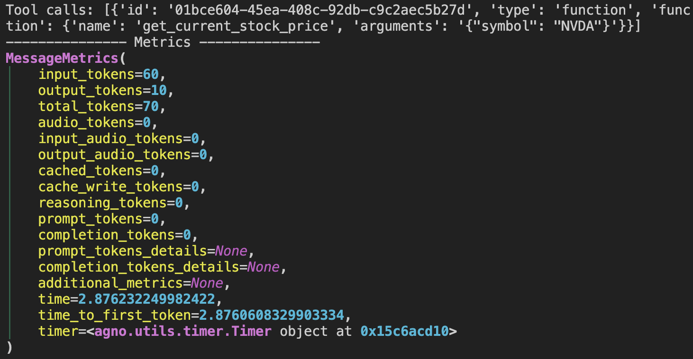
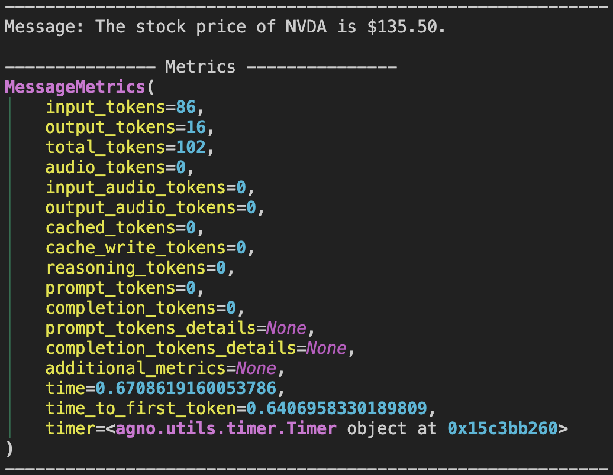
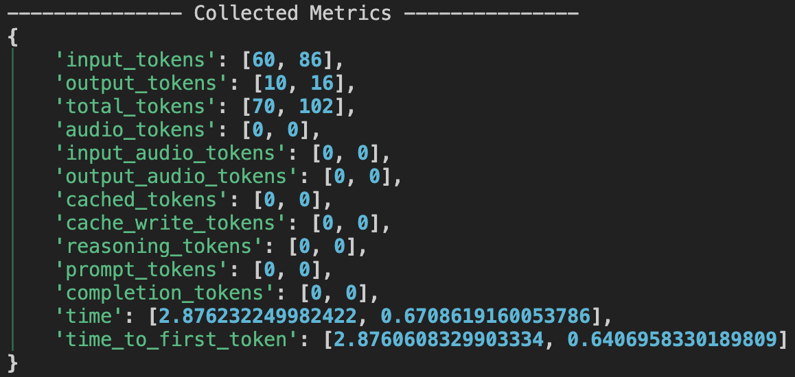

## 概要
Agno でエージェントを実行すると、取得する応答 (**RunResponse**) には、実行に関する詳細なメトリクスが含まれます。これらのメトリクスは、リソース使用量（**トークン使用量**や**時間**など）、パフォーマンス、およびモデルやツール呼び出しのその他の側面を理解するのに役立ちます。

メトリクスは複数のレベルで利用可能です。
- **メッセージごと**: 各メッセージ（アシスタント、ツールなど）には独自のメトリクスがあります。
- **ツール呼び出しごと**: 各ツール実行には独自のメトリクスがあります。
- **集計**: `RunResponse` は、実行内のすべてのメッセージにわたるメトリクスを集計します。

<Note>
メトリクスの場所
- `RunResponse.metrics`: 実行全体の集計メトリクス。辞書形式です。
- `ToolExecution.metrics`: 各ツール呼び出しのメトリクス。
- `Message.metrics`: 各メッセージ（アシスタント、ツールなど）のメトリクス。
</Note>

## 使用例
タスクを実行するエージェントがあり、実行後にメトリクスを分析したいとします。メトリクスにアクセスして印刷する方法は次のとおりです。

以下のコードを実行してエージェントを作成し、以下の構成で実行します。
```python
from typing import Iterator

from agno.agent import Agent, RunResponse
from agno.models.google import Gemini
from agno.tools.yfinance import YFinanceTools
from rich.pretty import pprint

agent = Agent(
    model=Gemini(id="gemini-2.0-flash-001"),
    tools=[YFinanceTools(stock_price=True)],
    markdown=True,
    show_tool_calls=True,
)

agent.print_response(
    "What is the stock price of NVDA", stream=True
)

# メッセージごとのメトリクスを表示
if agent.run_response.messages:
    for message in agent.run_response.messages:
        if message.role == "assistant":
            if message.content:
                print(f"Message: {message.content}")
            elif message.tool_calls:
                print(f"Tool calls: {message.tool_calls}")
            print("---" * 5, "Metrics", "---" * 5)
            pprint(message.metrics)
            print("---" * 20)

# 実行全体の集計メトリクスを表示
print("---" * 5, "Collected Metrics", "---" * 5)
pprint(agent.run_response.metrics)
# セッション全体の集計メトリクスを表示
print("---" * 5, "Session Metrics", "---" * 5)
pprint(agent.session_metrics)
```

以下のような情報を含む出力が表示されます。
### ツール実行メトリクス

このセクションでは、各ツール実行のメトリクスを提供します。個々のツール呼び出しのリソース使用量とパフォーマンスの詳細が含まれています。



### メッセージメトリクス

ここでは、エージェントからの各メッセージ応答のメトリクスを確認できます。すべての「アシスタント」応答にはこのようなメトリクスがあり、メッセージレベルでのパフォーマンスとリソース使用量を理解するのに役立ちます。



### 集計実行メトリクス

集計メトリクスは、実行全体の包括的なビューを提供します。これには、すべてのメッセージとツール呼び出しの概要が含まれており、エージェントのパフォーマンスとリソース使用量の全体像を把握できます。



同様にセッションメトリクスでは、セッション内のすべての実行にわたる集計メトリクスを確認でき、複数の実行にわたるエージェントの全体的なパフォーマンスとリソース使用量に関する洞察を提供します。

## メトリクスの集計方法
- **メッセージごと**: 各メッセージ（アシスタント、ツールなど）には独自のメトリクスオブジェクトがあります。
- **実行レベル**: `RunResponse.metrics` は、各キー（例: `input_tokens`）が実行内のすべてのアシスタントメッセージの値のリストにマッピングされる辞書です。
- **セッションレベル**: `SessionMetrics`（`agent.session_metrics` を参照）は、セッション内のすべての実行にわたるメトリクスを集計します。

## `MessageMetrics` パラメータ
<Snippet file="message_metrics_params.mdx" />