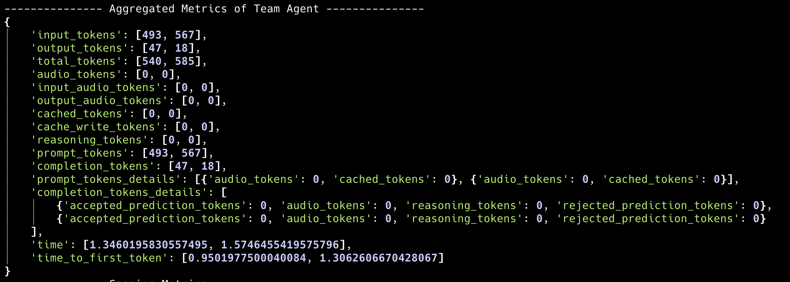
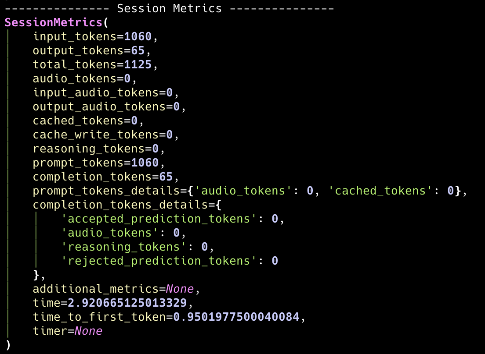
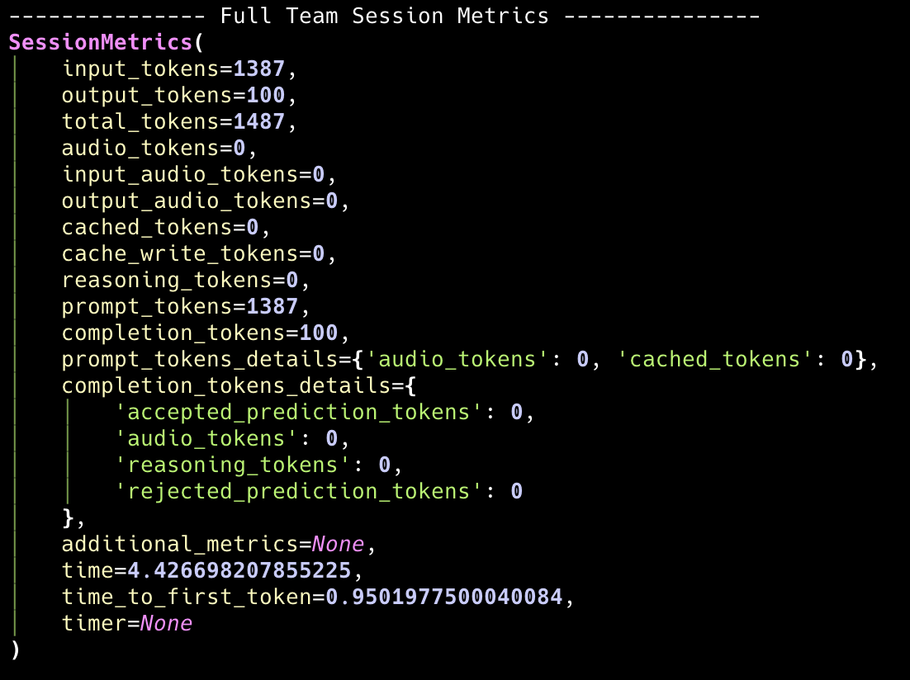

## Overview
When you run a team in Agno, the response you get (**TeamRunResponse**) includes detailed metrics about the run. These metrics help you understand resource usage (like **token usage** and **time**), performance, and other aspects of the model and tool calls across both the team leader and team members.

Metrics are available at multiple levels:
- **Per-message**: Each message (assistant, tool, etc.) has its own metrics.
- **Per-tool call**: Each tool execution has its own metrics.
- **Per-member run**: Each team member run has its own metrics.
- **Team-level**: The `TeamRunResponse` aggregates metrics across all team leader messages.
- **Session-level**: Aggregated metrics across all runs in the session, for both the team leader and all team members.

<Note>
Where Metrics Live
- `TeamRunResponse.metrics`: Aggregated metrics for the team leader's run, as a dictionary.
- `TeamRunResponse.member_responses`: Individual member responses with their own metrics.
- `ToolExecution.metrics`: Metrics for each tool call.
- `Message.metrics`: Metrics for each message (assistant, tool, etc.).
- `Team.session_metrics`: Session-level metrics for the team leader.
- `Team.full_team_session_metrics`: Session-level metrics including all team member metrics.
</Note>

## Example Usage
Suppose you have a team that performs some tasks and you want to analyze the metrics after running it. Here's how you can access and print the metrics:

```python
from typing import Iterator

from agno.agent import Agent, RunResponse
from agno.models.openai import OpenAIChat
from agno.team.team import Team
from agno.tools.yfinance import YFinanceTools
from agno.utils.pprint import pprint_run_response
from rich.pretty import pprint

# Create team members
stock_searcher = Agent(
    name="Stock Searcher",
    model=OpenAIChat("gpt-4o"),
    role="Searches the web for information on a stock.",
    tools=[YFinanceTools()],
)

# Create the team
team = Team(
    name="Stock Research Team",
    model=OpenAIChat("gpt-4o"),
    members=[stock_searcher],
    markdown=True,
)

# Run the team
run_stream: Iterator[RunResponse] = team.run(
    "What is the stock price of NVDA", stream=True
)
pprint_run_response(run_stream, markdown=True)

# Print team leader message metrics
print("---" * 5, "Team Leader Message Metrics", "---" * 5)
if team.run_response.messages:
    for message in team.run_response.messages:
        if message.role == "assistant":
            if message.content:
                print(f"Message: {message.content}")
            elif message.tool_calls:
                print(f"Tool calls: {message.tool_calls}")
            print("---" * 5, "Metrics", "---" * 5)
            pprint(message.metrics)
            print("---" * 20)

# Print aggregated team leader metrics
print("---" * 5, "Aggregated Metrics of Team Agent", "---" * 5)
pprint(team.run_response.metrics)

# Print team leader session metrics
print("---" * 5, "Session Metrics", "---" * 5)
pprint(team.session_metrics)

# Print team member message metrics
print("---" * 5, "Team Member Message Metrics", "---" * 5)
if team.run_response.member_responses:
    for member_response in team.run_response.member_responses:
        if member_response.messages:
            for message in member_response.messages:
                if message.role == "assistant":
                    if message.content:
                        print(f"Message: {message.content}")
                    elif message.tool_calls:
                        print(f"Tool calls: {message.tool_calls}")
                    print("---" * 5, "Metrics", "---" * 5)
                    pprint(message.metrics)
                    print("---" * 20)

# Print full team session metrics (including all members)
print("---" * 5, "Full Team Session Metrics", "---" * 5)
pprint(team.full_team_session_metrics)
```

## Team Leader Metrics

### Team Leader Message Metrics

This section provides metrics for each message response from the team leader. All "assistant" responses will have metrics like this, helping you understand the performance and resource usage at the message level.


### Aggregated Team Leader Metrics

The aggregated metrics provide a comprehensive view of the team leader's run. This includes a summary of all messages and tool calls, giving you an overall picture of the team leader's performance and resource usage.



## Team Member Metrics

### Individual Member Metrics

Each team member has their own metrics that can be accessed through `team.run_response.member_responses`. This allows you to analyze the performance of individual team members.


### Member Response Structure

Each member response contains:
- `messages`: List of messages with individual metrics
- `metrics`: Aggregated metrics for that member's run
- `tools`: Tool executions with their own metrics

## Session-Level Metrics

### Team Leader Session Metrics

The `team.session_metrics` provides aggregated metrics across all runs in the session for the team leader only.



### Full Team Session Metrics

The `team.full_team_session_metrics` provides comprehensive metrics that include both the team leader and all team members across all runs in the session.



## How Metrics Are Aggregated

### Team Leader Level
- **Per-message**: Each message (assistant, tool, etc.) has its own metrics object.
- **Run-level**: `TeamRunResponse.metrics` is a dictionary where each key (e.g., input_tokens) maps to a list of values from all assistant messages in the run.
- **Session-level**: `team.session_metrics` aggregates metrics across all team leader runs in the session.

### Team Member Level
- **Per-member**: Each team member has their own metrics tracked separately.
- **Member aggregation**: Individual member metrics are aggregated within their respective `RunResponse` objects.
- **Full team aggregation**: `team.full_team_session_metrics` combines metrics from the team leader and all team members.

### Cross-Member Aggregation
- **Session-level**: `team.full_team_session_metrics` provides a complete view of all token usage and performance metrics across the entire team.

## Accessing Member Metrics Programmatically

You can access individual member metrics in several ways:

```python
# Access metrics for a specific member
for member_response in team.run_response.member_responses:
    print(f"Member: {member_response.member_id}")
    print(f"Member metrics: {member_response.metrics}")
    
    # Access individual messages
    for message in member_response.messages:
        if message.role == "assistant":
            print(f"Message metrics: {message.metrics}")
```

## Metrics Comparison

| Metric Level | Access Method | Description |
|--------------|---------------|-------------|
| **Team Leader Run** | `team.run_response.metrics` | Aggregated metrics for the current run |
| **Team Leader Session** | `team.session_metrics` | Aggregated metrics across all team leader runs |
| **Individual Member** | `member_response.metrics` | Metrics for a specific team member's run |
| **Full Team Session** | `team.full_team_session_metrics` | Complete team metrics including all members |

## `MessageMetrics` Params
<Snippet file="message_metrics_params.mdx" /> 

## `SessionMetrics` Params
<Snippet file="session_metrics_params.mdx" /> 